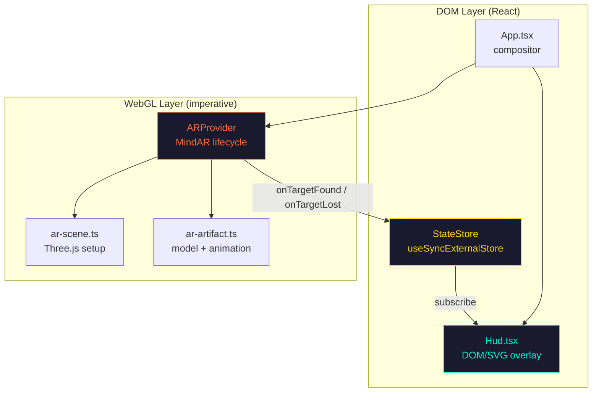
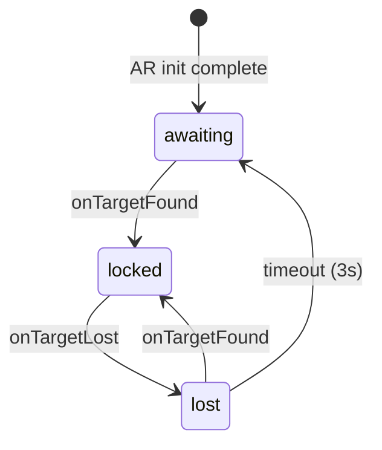
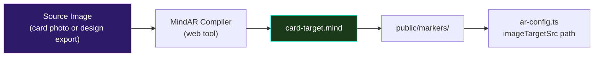

# SURREAL EXP LAB // DEMO V1 — Implementation Plan

## Situation Assessment

The project is a **fresh Vite + React 19 + TypeScript scaffold** with `mind-ar@1.2.5`, `three@0.184`, and `@types/three` already installed. All source files are default template boilerplate — no custom code exists yet.

**Existing ecosystem assets reviewed:**
- **SURREAL INFINITY AR** — prior vanilla HTML+JS MindAR prototype (v1.1.5, CDN-based, no build system). Contains a working `crystal.glb` model, a compiled `.mind` marker, and a basic MindAR→Three.js integration pattern.
- **Main folio repo** — Next.js-based spatial portfolio with established patterns: `StateStore` (useSyncExternalStore), typed `EventBus`, `HUD_TOKENS` design system (NORMAL / IR / SCAN modes), parallax system. These patterns inform—but do not dictate—the AR demo's architecture.
- **AR assets directory** — Several GLB models and compiled `.mind` marker files available.

---

## User Review Required

> [!IMPORTANT]
> **Marker image decision.** The `.mind` target file must be compiled from either:
> - (A) A photo of the physical embossed business card, or
> - (B) A high-contrast design export.
> 
> This compilation happens via the [MindAR Image Compiler](https://hiukim.github.io/mind-ar-js-doc/tools/compile) and produces a `.mind` binary. The marker must be finalized before Phase 2 testing begins. Please confirm which source image you plan to use, or whether you want the architecture to support hot-swapping both during development.

> [!IMPORTANT]
> **Artifact 3D model.** Which GLB model should serve as the floating artifact entity?
> - Existing `crystal.glb` from the INFINITY AR project?
> - One of the Meshy AI models from `AR/assets/`?
> - A new model to be supplied later?
> 
> The architecture will support swapping, but knowing the target model size/complexity affects performance budget decisions.

> [!IMPORTANT]
> **Gateway URL.** The "OPEN WEB GATEWAY" action needs a target URL. Should this point to:
> - The deployed main folio site?
> - A specific landing page?
> - A placeholder URL for now?

---

## Open Questions

> [!NOTE]
> **Device orientation parallax.** The spec mentions gyro/device-orientation as a "future hook." Should I:
> - (A) Wire the hook infrastructure but leave it disabled (adds ~20 lines, zero runtime cost), or
> - (B) Skip entirely and only implement mouse parallax for desktop dev/testing?

> [!NOTE]
> **Sound.** The spec doesn't mention audio. Confirming: no audio for V1?

---

## 1. Repository Structure

```
EXP_LAB_FOLIO AR/
├── index.html                    # Entry — meta, viewport lock, #root
├── vite.config.ts                # Vite config — HTTPS, static assets
├── tsconfig.app.json             # Existing TS config
├── package.json                  # Dependencies
│
├── public/
│   ├── favicon.svg               # Existing
│   ├── markers/
│   │   └── card-target.mind      # Compiled MindAR image target
│   └── models/
│       └── artifact.glb          # Floating artifact entity model
│
├── src/
│   ├── main.tsx                  # React root mount
│   ├── App.tsx                   # Root compositor — layers AR + HUD
│   │
│   ├── types/
│   │   └── mind-ar.d.ts          # MindAR type declarations
│   │
│   ├── ar/                       # ══ AR SCENE LAYER ══
│   │   ├── ar-provider.tsx       # MindAR lifecycle manager (React wrapper)
│   │   ├── ar-scene.ts           # Three.js scene setup (lights, env)
│   │   ├── ar-artifact.ts        # Artifact entity (load, animate, material)
│   │   └── ar-config.ts          # Constants: model path, scale, filter params
│   │
│   ├── hud/                      # ══ HUD OVERLAY LAYER ══
│   │   ├── Hud.tsx               # HUD root — state-driven shell
│   │   ├── Hud.css               # HUD styles + IR mode variants
│   │   ├── hud-tokens.ts         # Design tokens (COLOR/IR palettes)
│   │   ├── StatusBar.tsx         # Top bar: mode badge, version, signal
│   │   ├── Reticle.tsx           # Center tracking reticle
│   │   ├── GatewayAction.tsx     # Bottom CTA: OPEN WEB GATEWAY
│   │   └── SignalIndicator.tsx   # Signal strength indicator
│   │
│   ├── state/                    # ══ STATE LAYER ══
│   │   ├── store.ts              # StateStore (useSyncExternalStore)
│   │   └── types.ts              # TrackingState, HudMode, AppState
│   │
│   ├── hooks/                    # ══ SHARED HOOKS ══
│   │   ├── use-parallax.ts       # Mouse parallax (+ gyro stub)
│   │   └── use-app-state.ts      # Typed accessor for store
│   │
│   └── styles/                   # ══ GLOBAL STYLES ══
│       └── index.css             # Reset, viewport lock, CSS variables
│
└── .gitignore
```

### Design rationale

| Decision | Why |
|---|---|
| `ar/` and `hud/` as sibling directories | Enforces physical separation of WebGL and DOM layers. No imports should cross between them — they communicate only through `state/`. |
| `state/store.ts` uses `useSyncExternalStore` | Mirrors the proven pattern from the main folio (`StateStore`). Zero dependencies. React 19 native. |
| No router, no context providers, no Redux | Demo scope. Single-screen experience. State is flat. |
| Models and markers in `public/` | Static assets served as-is by Vite. No bundling needed for binary files. Enables easy swapping. |
| `types/mind-ar.d.ts` | MindAR has no `@types` package. We declare the subset we use. |

---

## 2. AR / HUD Separation Strategy



### Rules

1. **HUD never imports from `ar/`**. It reads state, never touches the scene graph.
2. **AR never imports from `hud/`**. It writes state, never touches the DOM.
3. **State is the only bridge.** `ar/` writes → `state/store` → `hud/` reads.
4. **ARProvider owns the `<div>` container** for the MindAR canvas. This div is a sibling to the HUD overlay, both children of `App.tsx`.
5. **HUD is `position: fixed; pointer-events: none`** over the full viewport. Individual interactive elements (gateway button) get `pointer-events: auto`.

---

## 3. State Flow Architecture

```typescript
// state/types.ts
type TrackingState = 'awaiting' | 'locked' | 'lost';
type HudMode = 'COLOR' | 'IR';

interface AppState {
  tracking: TrackingState;       // driven by MindAR callbacks
  hudMode: HudMode;              // toggled by user
  signalStrength: number;        // 0–1, derived from tracking confidence
  arReady: boolean;              // MindAR initialized + camera streaming
  modelLoaded: boolean;          // GLB loaded successfully
}
```

### State transitions



- `awaiting` — camera active, no marker detected. HUD shows "HOLD STEADY" prompt.
- `locked` — marker actively tracked. HUD shows artifact info + GATEWAY action.
- `lost` — marker was tracked but lost. HUD shows re-acquisition prompt. After 3s timeout, falls back to `awaiting`.

### State store implementation

Follows the main folio's `StateStore` pattern exactly:

```typescript
// state/store.ts
class ARStateStore {
  private state: AppState = { /* defaults */ };
  private listeners = new Set<() => void>();
  
  getState() { return this.state; }
  setState(updates: Partial<AppState>) { /* ... notify */ }
  subscribe = (listener: () => void) => { /* ... */ };
}

export const arStore = new ARStateStore();

// hooks/use-app-state.ts
export function useAppState() {
  return useSyncExternalStore(
    arStore.subscribe,
    () => arStore.getState(),
    () => arStore.getState()
  );
}
```

---

## 4. Implementation Phases

### Phase 0 — Scaffold Cleanup + Infrastructure
**Estimated effort: 30 min**

| Task | Detail |
|---|---|
| Strip Vite template boilerplate | Remove default App.tsx content, App.css, template assets |
| Create directory structure | `ar/`, `hud/`, `state/`, `hooks/`, `types/`, `styles/` |
| Write `mind-ar.d.ts` | Type declarations for `MindARThree` |
| Configure `vite.config.ts` | Add HTTPS for local mobile testing (via `@vitejs/plugin-basic-ssl` or manual cert) |
| Configure `index.html` | Viewport lock, meta tags, proper title |
| Write `styles/index.css` | Full viewport reset, CSS custom properties, font imports |
| Write `state/types.ts` + `state/store.ts` | State infrastructure |
| Write `hooks/use-app-state.ts` | State hook |

---

### Phase 1 — AR Scene Layer (Bare Minimum)
**Estimated effort: 1–2 hours**

| Task | Detail |
|---|---|
| Write `ar/ar-config.ts` | Model path, scale, marker path, MindAR filter params |
| Write `ar/ar-scene.ts` | Three.js scene factory: ambient light, subtle directional, no shadows |
| Write `ar/ar-artifact.ts` | GLTFLoader → load model, attach to anchor, slow Y-rotation |
| Write `ar/ar-provider.tsx` | React component: creates container div, inits MindAR, manages lifecycle (start/stop/cleanup), wires `onTargetFound`/`onTargetLost` to state store |
| Wire `App.tsx` | Render `<ARProvider />` + placeholder HUD |
| **Milestone** | Camera opens, marker detection works, 3D model appears on marker |

**Performance config for MindAR:**
```typescript
// ar/ar-config.ts
export const MINDAR_CONFIG = {
  filterMinCF: 0.0001,    // aggressive smoothing — less jitter
  filterBeta: 1000,        // default speed response
  warmupTolerance: 5,      // 5 frames before target-found
  missTolerance: 5,        // 5 frames before target-lost
} as const;
```

---

### Phase 2 — HUD Overlay Layer
**Estimated effort: 2–3 hours**

| Task | Detail |
|---|---|
| Write `hud/hud-tokens.ts` | COLOR + IR palette tokens (adapted from main folio's `HUD_TOKENS`) |
| Write `hud/Hud.tsx` + `Hud.css` | Full-viewport fixed overlay, state-driven visibility |
| Write `hud/StatusBar.tsx` | Top: `FIELD DEMO` badge, `VERSION 0.1`, mode indicator |
| Write `hud/Reticle.tsx` | Center: tracking reticle with state-driven animation (pulse on awaiting, lock on locked, fade on lost) |
| Write `hud/SignalIndicator.tsx` | Signal strength bars |
| Write `hud/GatewayAction.tsx` | Bottom: `OPEN WEB GATEWAY` button, visible only in `locked` state |
| Write `hooks/use-parallax.ts` | Mouse-driven parallax with layered depth values |
| Integrate parallax into HUD layers | Subtle offset on reticle, frames, grid |
| **Milestone** | Full HUD visible over camera feed, responds to tracking state changes |

**HUD token structure (adapted for AR demo):**

```typescript
export const HUD_TOKENS = {
  COLOR: {
    accent: '#00f0d4',
    accentDim: '#00f0d466',
    accentGlow: '#00f0d422',
    bg: 'rgba(0, 0, 0, 0.6)',
  },
  IR: {
    accent: '#dc2626',        // crimson red primary
    accentDim: '#dc262666',
    accentGlow: '#dc262622',
    secondary: '#f59e0b',     // amber/yellow secondary
    bg: 'rgba(20, 0, 0, 0.7)',
  },
} as const;
```

---

### Phase 3 — Mode System + Polish
**Estimated effort: 1–2 hours**

| Task | Detail |
|---|---|
| Implement COLOR/IR toggle | HUD mode button, updates `arStore.setState({ hudMode })` |
| IR mode CSS variants | All HUD elements switch to crimson/amber palette via CSS custom properties driven by `data-mode` attribute |
| IR mode Three.js tinting (optional, lightweight) | Swap artifact material color/emissive tint when IR mode is active. No shader changes — just `material.color.set()`. |
| Transition animations | Smooth mode crossfade (CSS transitions only, no JS animation libraries) |
| Lost → awaiting timeout | 3-second timer on target-lost |
| Edge case hardening | Double-start prevention, cleanup on unmount, camera permission denial handling |
| **Milestone** | Full experience loop: scan → lock → interact → mode switch → lose → re-acquire |

---

### Phase 4 — Deployment + Presentation Prep
**Estimated effort: 1 hour**

| Task | Detail |
|---|---|
| Vercel config | `vercel.json` with proper headers (camera permissions) |
| Production build test | `pnpm build` → verify no errors |
| Mobile testing via ngrok | Verify on physical device |
| Marker print verification | Test with actual printed card |
| Performance audit | Check FPS on target devices |
| **Milestone** | Deployable, presentation-ready artifact |

---

## 5. Asset Pipeline Strategy

### 3D Models
| Concern | Strategy |
|---|---|
| Format | GLB only (binary glTF, single file, no external textures) |
| Budget | ≤ 500K triangles, ideally ≤ 50K for mobile AR |
| Materials | `MeshBasicMaterial` or `MeshMatcapMaterial`. No PBR, no environment maps. Baked emissive textures preferred. |
| Loading | `GLTFLoader` from `three/examples/jsm/loaders/GLTFLoader`. No Draco compression (avoids WASM decoder overhead for a single model). |
| Location | `public/models/artifact.glb` — served as static asset, not bundled |

### Marker Targets
| Concern | Strategy |
|---|---|
| Compilation | Use [MindAR Image Compiler](https://hiukim.github.io/mind-ar-js-doc/tools/compile) web tool |
| Format | `.mind` binary |
| Location | `public/markers/card-target.mind` |
| Swapping | Change path in `ar/ar-config.ts` — single constant |

### Textures
- No separate texture files. All baked into GLB.
- HUD is pure CSS/SVG — no raster assets.

---

## 6. Marker Workflow Strategy



### Quality guidelines for marker images:
1. **High contrast** — strong edges, distinct features
2. **Non-repetitive** — avoid symmetrical patterns (MindAR struggles with symmetry)
3. **Minimum 300×300 px** source image
4. **Flat, non-glossy** capture if photographing the physical card
5. **Test with the compiler's confidence score** — aim for 3+ stars

### Swapping markers during development:
- Replace `public/markers/card-target.mind`
- No code changes needed (path is in `ar-config.ts`)
- HMR won't catch `.mind` file changes — manual page refresh required

---

## 7. Mobile Performance Safeguards

| Safeguard | Implementation |
|---|---|
| **No post-processing** | No EffectComposer, no bloom, no FXAA |
| **No dynamic shadows** | All lights: `castShadow = false` |
| **MeshBasicMaterial / MeshMatcapMaterial** | No PBR lighting calculations |
| **No environment maps** | Zero texture lookups for reflections |
| **requestAnimationFrame throttle** | Consider capping at 30fps if battery drain is an issue (MindAR internally targets 30fps anyway) |
| **Single draw call target** | One model, merged geometry if possible |
| **DOM HUD** | All text and UI is CSS/SVG, zero WebGL text rendering |
| **CSS `will-change` sparingly** | Only on parallax-transformed elements |
| **`<meta viewport>` locked** | `width=device-width, initial-scale=1, maximum-scale=1, user-scalable=no` — prevents pinch-zoom interfering with camera |
| **Passive event listeners** | All touch handlers marked `{ passive: true }` |
| **Cleanup on visibility change** | Pause render loop when tab backgrounded |

---

## 8. Vercel Deployment Strategy

### `vercel.json`
```json
{
  "headers": [
    {
      "source": "/(.*)",
      "headers": [
        { "key": "Permissions-Policy", "value": "camera=(*), gyroscope=(*)" },
        { "key": "Cross-Origin-Opener-Policy", "value": "same-origin" },
        { "key": "Cross-Origin-Embedder-Policy", "value": "require-corp" }
      ]
    }
  ]
}
```

### Key considerations:
- **HTTPS mandatory** — camera API requires secure context. Vercel provides this automatically.
- **Permissions-Policy header** — explicitly allows camera and gyroscope access.
- **COOP/COEP headers** — enables `SharedArrayBuffer` if MindAR's WASM needs it (defensive, may not be required for v1.2.5).
- **Static asset caching** — `.mind` and `.glb` files benefit from long cache TTL. Vite's content-hashed output handles this for bundled assets; static files in `public/` should use explicit cache headers if needed.
- **No server-side anything** — pure static SPA deployment.

### Local HTTPS testing:
```bash
# Option A: Vite plugin
pnpm add -D @vitejs/plugin-basic-ssl

# Option B: ngrok tunnel (for mobile testing)
ngrok http 5173
```

---

## 9. AntiGravity ↔ VS Code Workflow Boundaries

| Owned by AntiGravity | Owned by VS Code / Manual |
|---|---|
| All `.ts`, `.tsx`, `.css` source files | `.mind` marker compilation (web tool) |
| Type declarations | GLB model creation/optimization (Blender, Meshy) |
| Vite config modifications | Physical card photography |
| `vercel.json` | ngrok tunnel management |
| `package.json` dependency additions | Device testing |
| Git operations (if requested) | Vercel dashboard deployment config |
| Build verification (`pnpm build`) | Print production |

### What AntiGravity should NOT do:
- Modify binary files (`.mind`, `.glb`)
- Run deployment commands without explicit approval
- Install global system dependencies
- Make architectural decisions beyond the approved plan

---

## 10. Modularity Decisions

### Designed for future ecosystem integration

| Module | Reusable? | Strategy |
|---|---|---|
| `state/store.ts` | ✅ | Same `StateStore` pattern as main folio. Could be extracted to shared package. |
| `hud/hud-tokens.ts` | ✅ | Superset of main folio tokens. Should stay aligned. |
| `hooks/use-parallax.ts` | ✅ | Generic mouse/gyro parallax. Framework-agnostic logic. |
| `hud/Hud.tsx` component tree | ⚠️ Partially | HUD visual language is reusable; state bindings are demo-specific. |
| `ar/ar-provider.tsx` | ⚠️ Partially | MindAR lifecycle pattern is reusable; marker/model config is demo-specific. |

### Intentionally temporary / demo-specific

| Item | Why temporary |
|---|---|
| `ar/ar-config.ts` hardcoded paths | Demo uses one marker, one model. Production would use a config system. |
| `GatewayAction.tsx` | Demo-specific CTA. Production would have richer interaction. |
| `VERSION 0.1` badge | Presentation artifact. |
| `FIELD DEMO` label | Presentation artifact. |
| Lost → awaiting 3s timeout | Simplified state machine. Production would have re-acquisition UX. |
| Single-marker tracking | Demo constraint. Production might track multiple targets. |

---

## 11. Dependency Recommendations

### Already installed (keep as-is):
- `react@19.2.6` / `react-dom@19.2.6`
- `three@0.184.0` / `@types/three@0.184.1`
- `mind-ar@1.2.5`

### Recommended additions:

| Package | Purpose | Dev? |
|---|---|---|
| `@vitejs/plugin-basic-ssl` | Local HTTPS for camera testing on desktop | ✅ |

### Explicitly NOT recommended:
| Package | Why not |
|---|---|
| `@react-three/fiber` | Unnecessary abstraction over Three.js for this scope. MindAR manages its own renderer. |
| `@react-three/drei` | Same — would fight MindAR's scene ownership. |
| `zustand` / `jotai` / `valtio` | Overkill. `useSyncExternalStore` covers our needs with zero deps. |
| `framer-motion` | CSS transitions are sufficient. Avoids bundle size. |
| `gsap` | Same — not justified for this scope. |
| `postprocessing` / `@react-three/postprocessing` | Explicitly excluded by performance requirements. |

---

## 12. Risk Warnings

> [!WARNING]
> **MindAR + React 19 compatibility.** MindAR 1.2.5 was released before React 19. The library doesn't use React internally (it's imperative Three.js), but verify that its WASM initialization doesn't conflict with React 19's concurrent features. Mitigation: wrap MindAR init in a `useEffect` with proper cleanup, test early in Phase 1.

> [!WARNING]
> **Camera permission UX on iOS Safari.** iOS requires a user gesture before camera access. The experience must include a "Start AR" tap before initializing MindAR. This is NOT optional — iOS will silently fail without it. Phase 1 must include a permission gate screen.

> [!WARNING]
> **MindAR WASM bundle size.** The `mind-ar` package includes a ~2MB WASM binary for image tracking. This affects initial load time on slow connections. Mitigation: show a branded loading screen during initialization. Consider lazy-loading the MindAR module.

> [!CAUTION]
> **Marker quality is the #1 risk to presentation reliability.** A poor marker image will cause unstable tracking regardless of code quality. Test the compiled `.mind` file extensively on the physical printed card before the presentation. Have a backup high-contrast digital marker ready.

> [!NOTE]
> **Three.js version alignment.** MindAR 1.2.5 treats Three.js as an external peer dependency (minimum v137). Three.js 0.184 is well above this threshold — no issues expected.

---

## Verification Plan

### Automated Tests
- `pnpm build` — TypeScript compilation + Vite production build (no runtime errors)
- Verify no circular imports between `ar/`, `hud/`, `state/` directories

### Manual Verification (Browser)
1. **Desktop Chrome**: Camera opens, marker detection works, HUD renders, mode toggle works
2. **Mobile Safari (iOS)**: Permission gate → camera → tracking → HUD → gateway link
3. **Mobile Chrome (Android)**: Same flow as iOS
4. **Performance**: Sustained 30fps on mid-range mobile device during tracking
5. **Vercel deployment**: HTTPS serves correctly, camera permissions work on deployed URL

### Presentation Checklist
- [ ] Physical card marker tracks reliably at arm's length
- [ ] HUD is readable on phone screen in both indoor and outdoor lighting
- [ ] Gateway link opens correctly
- [ ] COLOR ↔ IR mode transition is smooth
- [ ] Experience recovers gracefully from marker loss
- [ ] Loading screen is branded and informative (not a blank page)
